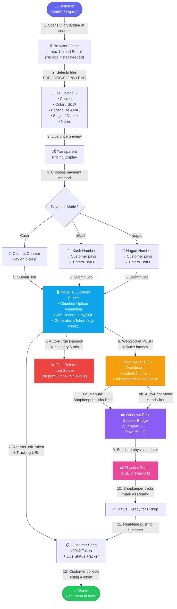
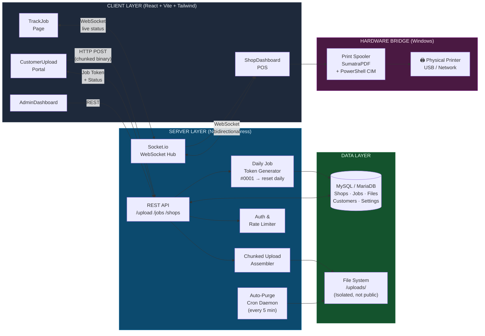
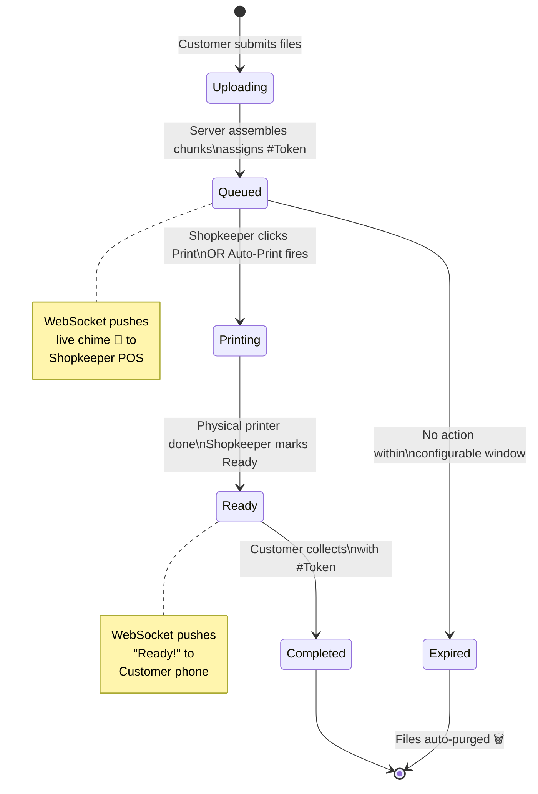

# prntez — Complete Process Diagrams

---

## 🗺️ Main End-to-End Flow

---

## 🏗️ System Architecture (Technical Layer View)

---

## 💳 Payment & Order Lifecycle

---

## 👥 Actor Summary

| Actor | Tool | Key Actions |
|---|---|---|
| **Customer** | Mobile browser (scan QR) | Upload → Configure → Pay → Track → Collect |
| **Server** | Node.js + MySQL | Assemble chunks → Store job → Push WebSocket → Purge files |
| **Shopkeeper** | POS Dashboard (browser) | Receive chime → Review job → Print → Mark done |
| **Print Bridge** | SumatraPDF + PowerShell | Receive command → Spool to Windows printer |
| **Printer** | USB / Network | Output physical document |
| **Purge Daemon** | Cron (5 min interval) | Delete expired files from disk → Zero data residue |
